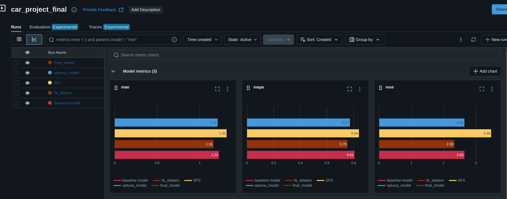

# Лабораторная работа "Интеллектуальные информационные системы"

## Описание проекта
Целью данного проекта является прогнозирование цен на поддержаные автомобили. Для данной задачи используется набор данных Car Price prediction: https://www.kaggle.com/datasets/vijayaadithyanvg/car-price-predictionused-cars/data.

## Запуск
```
git clone https://github.com/ZimovinMY/IsLab.git
cd IsLab
python -m venv .my_venv
source .my_venv/bin/activate
pip install -r requirements.txt
```
## Исследование данных
Основные результаты исследования, проведенного в файле ./eda/eda.ipynb:
1. Анализ показал, что данные корректны и не содержат избыточных записей.
2. Выявлены следующие закономерности:
- Большинство автомобилей продается через дилеров, а не напрямую от частных лиц. И цена на машину, продаваемую дилером, в среднем, на порядок выше, чем на машину, продаваемую на прямую.
- Преобладание автомобилей с механической коробкой передач указывает на присутствие в данных большей доли бюджетных моделей, которые часто оснащаются такой трансмиссией.
- Цена продажи автомобиля сильно зависит от его текущей цены. Чем выше текущая рыночная цена автомобиля, тем больше за него можно получить при продаже.
- Количество предыдущих владельцев слабо влияет на остальные параметры, что может говорить о том, что покупатели больше обращают внимание на такие характеристики, как текущая цена, пробег и возраст автомобиля.
- Большая часть значений находится в нижнем диапазоне (до 15 млн), что свидетельствует о преобладании автомобилей с низкой стоимостью.

## Запуск MLFlow
```
sh ./mlflow/start_mlflow.sh
```
После запуска MLFlow будет доступен по адресу: http://localhost:5000

## Результаты исследования
По результатам исследований были получены следующие метрики качества:



Наилучшие результаты в ходе эксперимента показала вторая модель, использующая RandomForestRegressor с определенными трансформациями входных данных. Для подготовки данных были применены следующие преобразования:

- PolynomialFeatures: Для двух числовых признаков ('Year', 'Driven_kms') с параметром degree=2. Полученные новые признаки были масштабированы, чтобы нормализовать их значения и улучшить работу модели.
- KBinsDiscretizer: Этот метод был использован для разбивки тек же двух числовых признаков на категории. Было принято решение разделять каждый выбранный признак на 3 категории. Такой подход позволил выявить скрытые закономерности в данных.

По итогам преобразований на вход модели подавались следующие данные:
<div>
<table border="1" class="dataframe">
  <thead>
    <tr style="text-align: right;">
      <th></th>
      <th>num__Year</th>
      <th>num__Selling_Price</th>
      <th>num__Driven_kms</th>
      <th>num__Owner</th>
      <th>cat__Car_Name</th>
      <th>cat__Fuel_Type</th>
      <th>cat__Selling_type</th>
      <th>cat__Transmission</th>
      <th>poly__Year</th>
      <th>poly__Driven_kms</th>
      <th>poly__Year^2</th>
      <th>poly__Year Driven_kms</th>
      <th>poly__Driven_kms^2</th>
      <th>kbin__Year</th>
      <th>kbin__Driven_kms</th>
    </tr>
  </thead>
  <tbody>
    <tr>
      <th>0</th>
      <td>1.171606</td>
      <td>-0.819553</td>
      <td>-0.797744</td>
      <td>-0.180741</td>
      <td>22.0</td>
      <td>2.0</td>
      <td>1.0</td>
      <td>0.0</td>
      <td>1.171606</td>
      <td>-0.797744</td>
      <td>1.172873</td>
      <td>-0.799057</td>
      <td>-0.186065</td>
      <td>2.0</td>
      <td>0.0</td>
    </tr>
    <tr>
      <th>1</th>
      <td>1.171606</td>
      <td>-0.657343</td>
      <td>-0.802502</td>
      <td>-0.180741</td>
      <td>34.0</td>
      <td>2.0</td>
      <td>1.0</td>
      <td>1.0</td>
      <td>1.171606</td>
      <td>-0.802502</td>
      <td>1.172873</td>
      <td>-0.803836</td>
      <td>-0.186163</td>
      <td>2.0</td>
      <td>0.0</td>
    </tr>
    <tr>
      <th>2</th>
      <td>0.828808</td>
      <td>0.470933</td>
      <td>-0.541795</td>
      <td>-0.180741</td>
      <td>69.0</td>
      <td>2.0</td>
      <td>0.0</td>
      <td>0.0</td>
      <td>0.828808</td>
      <td>-0.541795</td>
      <td>0.829287</td>
      <td>-0.542137</td>
      <td>-0.173878</td>
      <td>2.0</td>
      <td>0.0</td>
    </tr>
    <tr>
      <th>3</th>
      <td>-0.542382</td>
      <td>-0.069707</td>
      <td>-0.043623</td>
      <td>-0.180741</td>
      <td>75.0</td>
      <td>2.0</td>
      <td>0.0</td>
      <td>1.0</td>
      <td>-0.542382</td>
      <td>-0.043623</td>
      <td>-0.543355</td>
      <td>-0.043681</td>
      <td>-0.111314</td>
      <td>1.0</td>
      <td>0.0</td>
    </tr>
    <tr>
      <th>4</th>
      <td>0.486011</td>
      <td>0.097877</td>
      <td>-0.152412</td>
      <td>-0.180741</td>
      <td>49.0</td>
      <td>2.0</td>
      <td>0.0</td>
      <td>1.0</td>
      <td>0.486011</td>
      <td>-0.152412</td>
      <td>0.485871</td>
      <td>-0.151570</td>
      <td>-0.129356</td>
      <td>2.0</td>
      <td>0.0</td>
    </tr>
    <tr>
      <th>5</th>
      <td>-2.941964</td>
      <td>-0.258056</td>
      <td>3.790644</td>
      <td>-0.180741</td>
      <td>68.0</td>
      <td>1.0</td>
      <td>0.0</td>
      <td>1.0</td>
      <td>-2.941964</td>
      <td>3.790644</td>
      <td>-2.938919</td>
      <td>3.781911</td>
      <td>2.087737</td>
      <td>0.0</td>
      <td>1.0</td>
    </tr>
    <tr>
      <th>6</th>
      <td>-0.199584</td>
      <td>-0.368079</td>
      <td>0.453074</td>
      <td>-0.180741</td>
      <td>77.0</td>
      <td>2.0</td>
      <td>0.0</td>
      <td>1.0</td>
      <td>-0.199584</td>
      <td>0.453074</td>
      <td>-0.200450</td>
      <td>0.454685</td>
      <td>0.002155</td>
      <td>2.0</td>
      <td>0.0</td>
    </tr>
    <tr>
      <th>7</th>
      <td>0.486011</td>
      <td>0.070189</td>
      <td>-0.555926</td>
      <td>-0.180741</td>
      <td>49.0</td>
      <td>2.0</td>
      <td>0.0</td>
      <td>1.0</td>
      <td>0.486011</td>
      <td>-0.555926</td>
      <td>0.485871</td>
      <td>-0.556495</td>
      <td>-0.174904</td>
      <td>2.0</td>
      <td>0.0</td>
    </tr>
    <tr>
      <th>8</th>
      <td>0.828808</td>
      <td>-0.694503</td>
      <td>-0.067412</td>
      <td>-0.180741</td>
      <td>32.0</td>
      <td>2.0</td>
      <td>1.0</td>
      <td>1.0</td>
      <td>0.828808</td>
      <td>-0.067412</td>
      <td>0.829287</td>
      <td>-0.065859</td>
      <td>-0.115469</td>
      <td>2.0</td>
      <td>0.0</td>
    </tr>
    <tr>
      <th>9</th>
      <td>-0.199584</td>
      <td>-0.815819</td>
      <td>0.170481</td>
      <td>-0.180741</td>
      <td>11.0</td>
      <td>2.0</td>
      <td>1.0</td>
      <td>1.0</td>
      <td>-0.199584</td>
      <td>0.170481</td>
      <td>-0.200450</td>
      <td>0.171385</td>
      <td>-0.068658</td>
      <td>2.0</td>
      <td>0.0</td>
    </tr>
  </tbody>
</table>
</div>

Метрики качества лучшей модели:
- mae - 1.16
- mape - 0.75
- mse - 2.33

Далее модель, показавшая наилучший результат была обучена на всей выборке и залогирована в mlflow с тегом Prod:1. Run_id данной модели - a342c08f5a134a228e5e21d3cf010502

## Описание сервиса
1. ml_service - директория, содержащая следующие файлы:
- Dockerfile - описывает сборку Docker-образа и запуск контейнера
- api_handler.py - включает класс FastAPIHandler, который обрабатывает запросы к API. Этот класс загружает обученную модель, принимает входные данные и выполняет предсказания
- main.py - скрипт для запуска сервиса, обеспечивающего взаимодействие с моделью машинного обучения через API
- requirements.txt - содержит список зависимостей, необходимых для работы сервиса
2. models - директория, содержащая следующие файл:
- get_model.py - скрипт для подключения к MLflow, загрузки модели по её run_id и сохранения её в виде файла model.pkl
## Команды для создания образа и запуска контейнера
```
docker build . --tag car_price__model:1
docker run -p 8001:8000 -v $(pwd)/../models:/models car_price_model:1
```
## Проверка работоспособности модели в сервисе
Откройте в браузере адрес запущенного сервиса и перейдите в раздел /docs. Используйте интерфейс Swagger UI для тестирования доступных эндпоинтов.
## Пример тела запроса
```
{
  "Car_Name": "Toyota Corolla",
  "Year": 2015,
  "Selling_Price": 8.5,
  "Driven_kms": 45000,
  "Fuel_Type": "Petrol",
  "Selling_type": "Dealer",
  "Transmission": "Manual",
  "Owner": 1
}
```
## Пример ответа
```
{
  "car_id": 1,
  "price": 2.15
}
```
